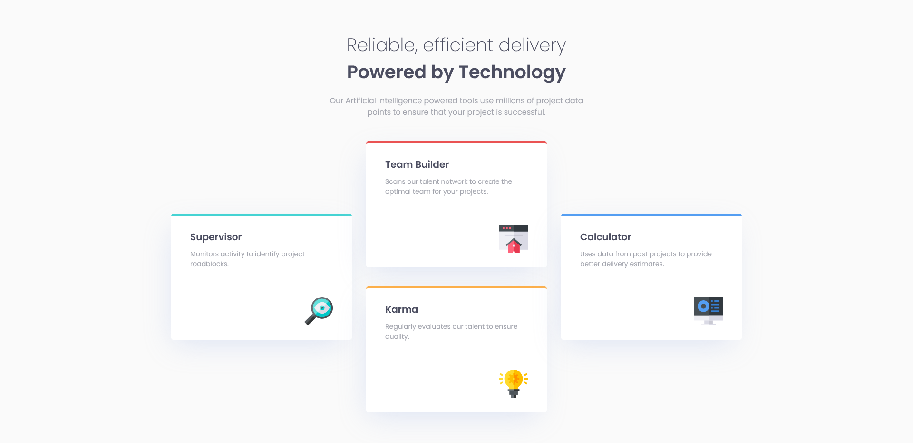
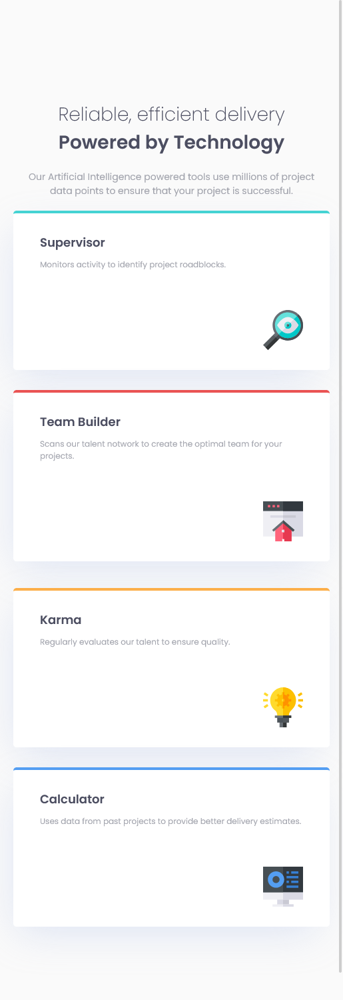

# Frontend Mentor - Four card feature section solution

This is a solution to the [Four card feature section challenge on Frontend Mentor](https://www.frontendmentor.io/challenges/four-card-feature-section-weK1eFYK). Frontend Mentor challenges help you improve your coding skills by building realistic projects.

## Table of contents

-   [Overview](#overview)
    -   [The challenge](#the-challenge)
    -   [Screenshot](#screenshot)
    -   [Links](#links)
-   [My process](#my-process)
    -   [Built with](#built-with)
    -   [What I learned](#what-i-learned)
    -   [Useful resources](#useful-resources)

## Overview

### The challenge

Users should be able to:

-   View the optimal layout for the site depending on their device's screen size

### Screenshot




### Links

-   Solution URL: [HERE](https://cheerful-horse-677925.netlify.app/)

## My process

### Built with

-   Semantic HTML5 markup
-   CSS custom properties
-   Flexbox
-   CSS Grid
-   Desktop-first workflow

### What I learned

Some of the things I learnt include using the appropriate aria labels to hide redundant content.

```html

```

### Useful resources

-   [CSS box shadow generator](https://cssgenerator.org/box-shadow-css-generator.html) - This website allows you to preview the box shadow-effect while also changing the values dynamically.
